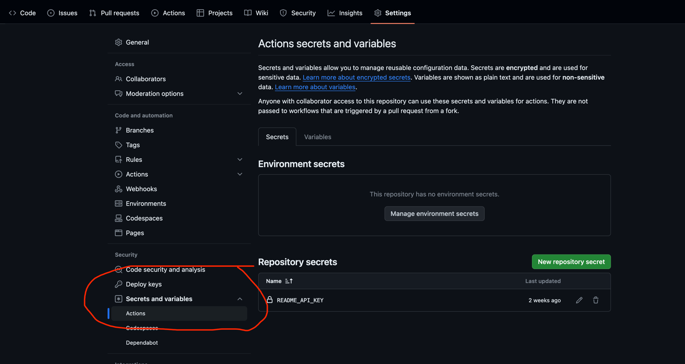

### SEAFILE OPEN API

1. set api on github settings  
   https://dash.readme.com/project/seafile-api/v1.0/api-key  
   https://github.com/haiwen/seafile-open-api/settings  
   
2. use rdme command tool to generate github workflows for api  
   create NEW CATEGORY on ADMIN PANEL  
   https://docs.readme.com/main/docs/rdme
3. set version of github workflows  
   set version of openapi version  
   up to the current branch  

   